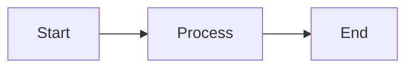

# HackMD Skill

## Overview
HackMD is a collaborative markdown platform that supports real-time editing, slide presentations, and embedded content. This skill covers best practices for creating HackMD-compatible documents, particularly with embedded SVG diagrams.

## Slide Mode

HackMD supports presentation mode using `---` separators between slides.

### YAML Frontmatter
```yaml
---
title: Presentation Title
tags: tag1, tag2
slideOptions:
  theme: white    # white, black, league, beige, sky, night, serif, simple, solarized
  transition: slide  # none, fade, slide, convex, concave, zoom
---
```

### Slide Controls
- `---` creates a new horizontal slide
- `----` creates a vertical slide (nested under previous)
- Press `S` for speaker view
- Press `F` for fullscreen
- Arrow keys to navigate

## SVG Embedding Best Practices

### ✅ DO: Use Direct Coordinates
```xml
<rect x="120" y="95" width="120" height="50" rx="8" fill="#4285f4"/>
<text x="180" y="115" text-anchor="middle" fill="white">Label</text>
```

### ❌ DON'T: Use Transform Translate
```xml
<!-- This may not render correctly in HackMD -->
<g transform="translate(180, 120)">
  <rect x="-60" y="-25" width="120" height="50"/>
</g>
```

### ✅ DO: Use Simple Markers in Defs
```xml
<defs>
  <marker id="arrowhead" markerWidth="10" markerHeight="7" refX="9" refY="3.5" orient="auto">
    <polygon points="0 0, 10 3.5, 0 7" fill="#666"/>
  </marker>
</defs>
```

### ❌ DON'T: Use Filters (Shadows, Blur, etc.)
```xml
<!-- These will NOT render in HackMD -->
<defs>
  <filter id="shadow">
    <feDropShadow dx="2" dy="2" stdDeviation="3"/>
  </filter>
</defs>
<rect filter="url(#shadow)"/>  <!-- Won't work -->
```

### ✅ DO: Use Unique IDs for Multiple SVGs
When embedding multiple SVGs in one document, use unique IDs to avoid conflicts:
```xml
<!-- First SVG -->
<marker id="arrow-slide1" ...>

<!-- Second SVG -->
<marker id="arrow-slide2" ...>
```

### ✅ DO: Use Inline Opacity
```xml
<g opacity="0.3">
  <rect .../>
  <text .../>
</g>
```

### ❌ DON'T: Use Complex CSS or External Stylesheets
```xml
<!-- Avoid -->
<style>
  .highlight { fill: blue; }
</style>
```

## SVG Template for HackMD

```xml
<svg viewBox="0 0 800 400" xmlns="http://www.w3.org/2000/svg" 
     style="font-family: -apple-system, BlinkMacSystemFont, Segoe UI, Roboto, sans-serif;">
  <defs>
    <marker id="arr" markerWidth="10" markerHeight="7" refX="9" refY="3.5" orient="auto">
      <polygon points="0 0, 10 3.5, 0 7" fill="#666"/>
    </marker>
  </defs>
  
  <!-- Background -->
  <rect x="0" y="0" width="800" height="400" fill="#f5f5f5"/>
  
  <!-- Boxes with direct coordinates -->
  <rect x="50" y="100" width="120" height="50" rx="8" fill="#4285f4" stroke="#1a73e8" stroke-width="2"/>
  <text x="110" y="130" text-anchor="middle" fill="white" font-size="12" font-weight="bold">Box 1</text>
  
  <!-- Arrows -->
  <path d="M 170 125 L 250 125" fill="none" stroke="#666" stroke-width="1.5" marker-end="url(#arr)"/>
  
  <!-- Dimmed elements -->
  <g opacity="0.3">
    <rect x="50" y="200" width="120" height="50" rx="8" fill="#4285f4"/>
    <text x="110" y="230" text-anchor="middle" fill="white" font-size="12">Inactive</text>
  </g>
</svg>
```

## Common Issues and Solutions

| Issue | Cause | Solution |
|-------|-------|----------|
| Boxes don't appear | Using `filter="url(#shadow)"` | Remove all filter attributes |
| Raw XML showing | Unclosed tags or special characters | Validate XML, escape `&` as `&amp;` |
| Elements misaligned | Using `transform="translate()"` | Use direct `x`, `y` coordinates |
| Arrows missing | ID conflicts between SVGs | Use unique IDs per SVG |
| Text cut off | ViewBox too small | Adjust viewBox dimensions |

## Supported SVG Features

| Feature | Supported | Notes |
|---------|-----------|-------|
| Basic shapes (rect, circle, path) | ✅ | |
| Text elements | ✅ | |
| Fill and stroke | ✅ | |
| Opacity | ✅ | |
| Markers (arrows) | ✅ | Keep simple |
| Gradients | ⚠️ | May work, test first |
| Filters (shadow, blur) | ❌ | Not supported |
| ClipPath | ⚠️ | Limited support |
| Animations | ❌ | Not supported |
| External fonts | ❌ | Use system fonts |

## Mermaid Alternative

For simpler diagrams, HackMD natively supports Mermaid:

~~~markdown

~~~

**When to use Mermaid vs SVG:**
- **Mermaid**: Quick flowcharts, sequence diagrams, simple graphs
- **SVG**: Custom styling, complex layouts, precise positioning, branded colors

## Export Options

From HackMD you can export to:
- PDF (from slide mode)
- HTML
- Markdown
- ODF

## References
- [HackMD Documentation](https://hackmd.io/c/tutorials)
- [HackMD Slide Mode](https://hackmd.io/slide-example)
